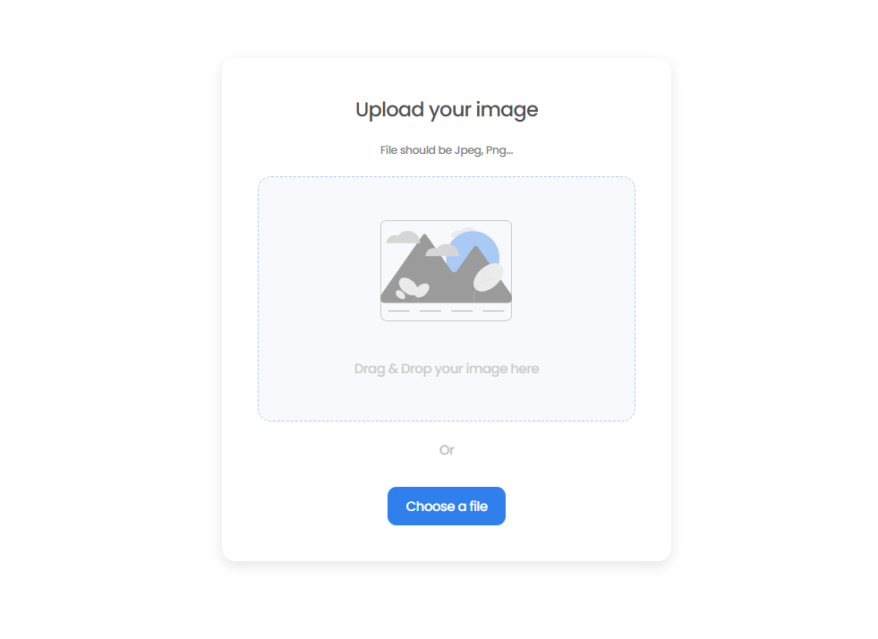
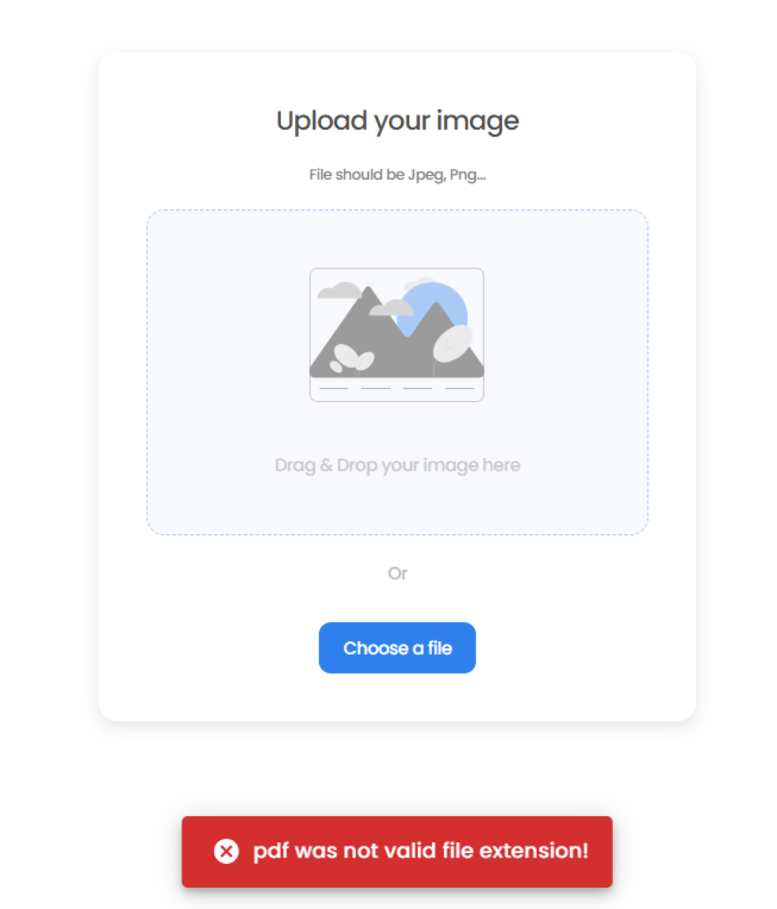
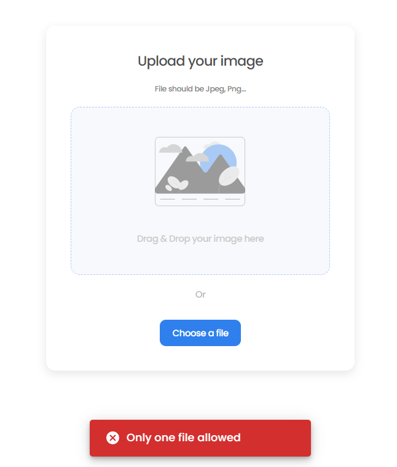
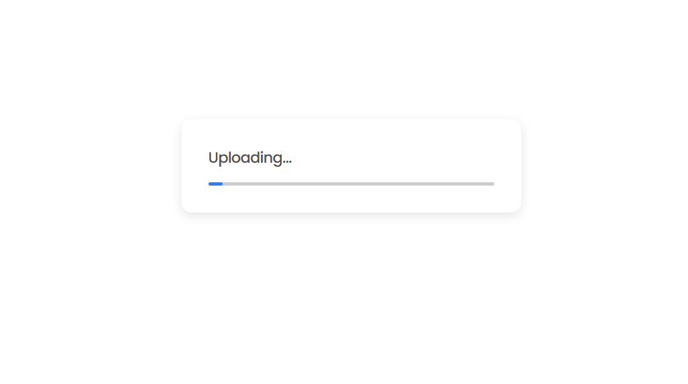
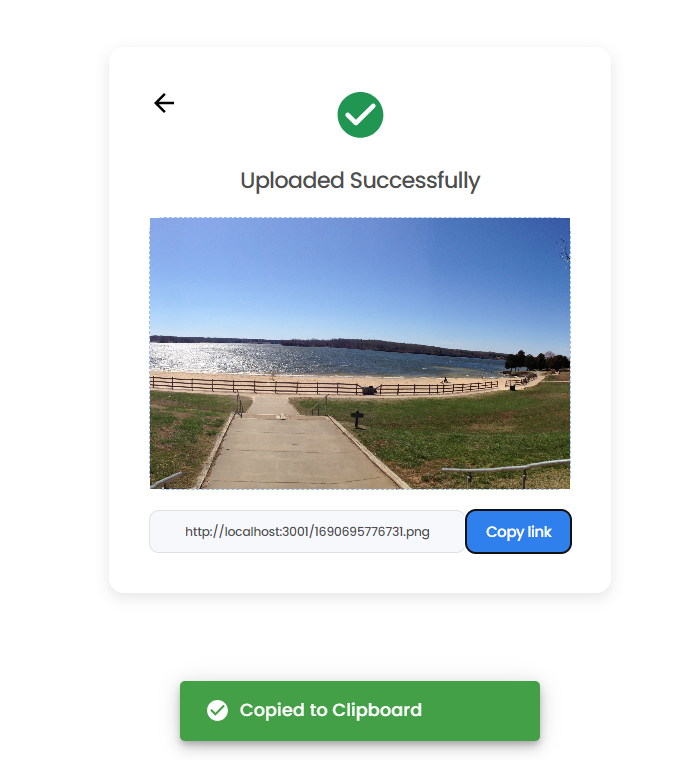

# Image Uploader
Proyecto basado en un desafio de [devchallenges](https://devchallenges.io/challenges/O2iGT9yBd6xZBrOcVirx) en el que se debía de crear un `Image-Uploader` tanto la parte Frontend como la API para subir las imagenes.

Los puntos a completar eran: 
- Poder arrastrar y soltar una imagen para cargarla
- Poder elegir una imagen de mis ficheros
- Ver un loader mientras se carga la imagen
- Una vez cargada la imagen, poder ver la imagen y copiarla
- Poder copiar la imagen al portapapeles

He generado un `monorepo` donde almaceno ambos proyectos, Frontend y Backend

## Screenshots

## Tecnologías usadas
  - [Vite](https://vitejs.dev/)
  - [Typescript](https://www.typescriptlang.org/)
  - [Tailwind](https://tailwindcss.com/)
  - [Node](https://nodejs.org/es)